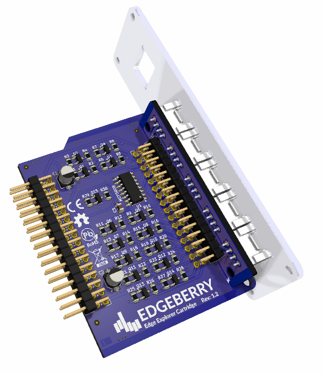

The Edgeberry **Edge Explorer Hardware Cartridge** is designed to explore ideas by easily connecting sensors, actuators and other peripherals to your Edgeberry system. The connector allows a robust connection to modules/breakouts from several ecosystems  (e.g. Grove, Crowtail, STEMMA, ... ).

#### Interfaces:
- 5x Digital in/out (PWM on D1)
- 2x Analog input (0-5V)
- 1x UART
- 2x I2C

 

## Layout
| Port | Connection            | Info |
|------|-----------------------|------|
| D1   | GPIO12  GPIO20    | PWM     |
| D2   | GPIO21  GPIO16    |      |
| D3   | GPIO13  GPIO24    |      |
| D4   | GPIO25  GPIO22    |      |
| D5   | GPIO23  GPIO27    |      |
| A1   | ADC CH0  ADC CH1  |MCP2008 |
| A2   | ADC CH2  ADC CH3  |      |
| I2C  | I2C SDA  I2C SDL  |      |
| UART | UART RX  UART TX  |      |

## License & Collaboration
**Copyright© 2024 Sanne 'SpuQ' Santens**. This project is released under the **CERN OHL-W** license. The [Rules & Guidelines](https://github.com/Edgeberry/.github/blob/main/brand/Edgeberry_Trademark_Rules_and_Guidelines.md) apply to the usage of the Edgeberry™ brand.

### Collaboration

If you'd like to contribute to this project, please follow these guidelines:
1. Fork the repository and create your branch from `main`.
2. Make your changes and ensure they adhere to the project's design style and conventions.
3. Test your changes thoroughly.
4. Ensure your commits are descriptive and well-documented.
5. Open a pull request, describing the changes you've made and the problem or feature they address.
